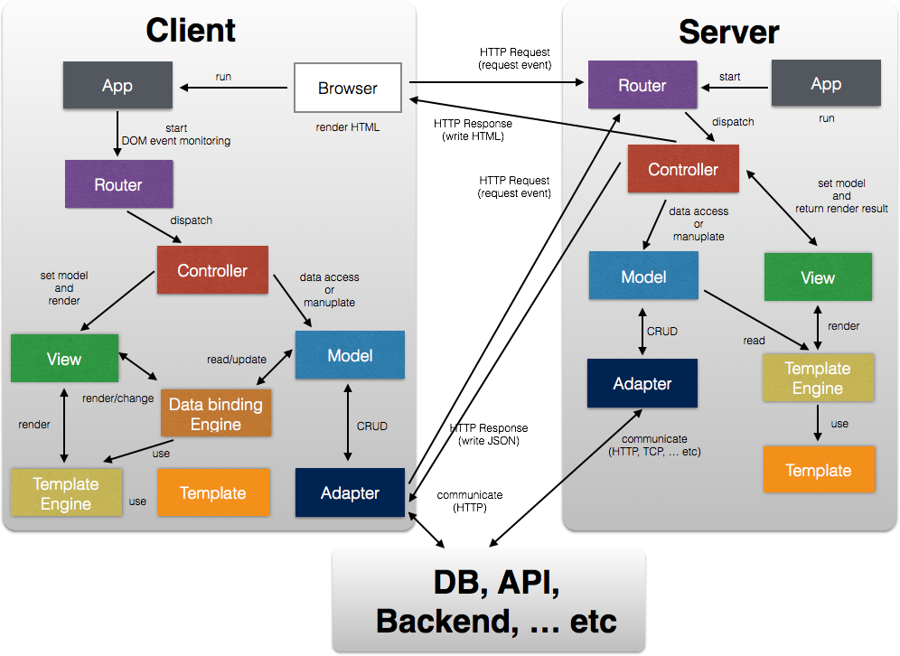
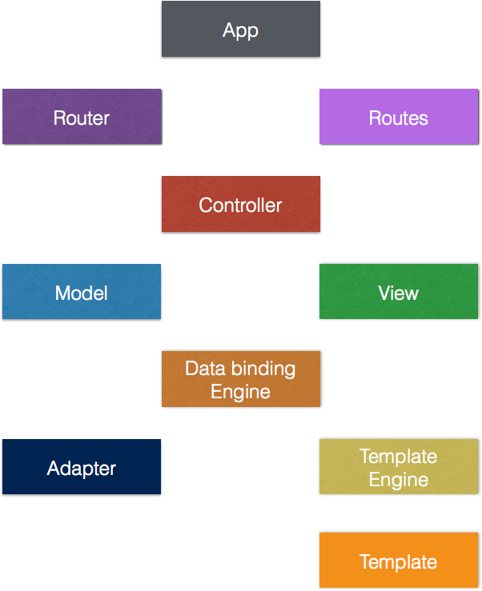

Fend Specification
==================

# About

This document is written specifications and design policy.


# Document History

See also `HISTORY.md`.


# Contributing
Open an issue or a pull request with any suggestions you may have.


# What is Fend ?

A JavaScript next generation web application framework for front-end.


# Concepts

- Rails のようなアプリケーション構造による Webアプリケーション開発の Rail 化
- クライアントサイドとサーバサイドで動作する isomorphic 的な JavaScript コード
- サーバサイドのレンダリングによるページローディングの高速化と SEO のサポート
- クライアントサイドとサーバサイドでの HTML テンプレートの共有
- クライアントサイドとサーバサイドでの ルーティングの共有
- Rails の Asset Pipeline のような、concat、minify された JavaScript、CSS などのリソース配信
- データバインディングによる View のレンダリング
- Adapter による柔軟なデータソースへアクセス
- Pluggable なモジュール (Ex: View、Model、etc...) のサポート


# Architecture
Fend のアーキテクチャを以下の図に示す。

 

TODO: write description


# Components

 

## App
`App` はアプリケーションの初期化など振舞いをカスタマイズしたり、アプリケーションの環境を設定したりする、エントリポイント的なもの。サーバサイドとクライアントサイドでなるべく同じ API を提供できるよう、うまく抽象化する。

## Router
`Router` は以下のイベントを監視して、`Controller` の適切なハンドラに dispatch してルーティングする。

- クライアントサイドでの `popstate` イベント
- サーバサイドでの `request` イベント
- クライアントサイドでのユーザーのボタンクリックなどの DOM イベント

`Router` は `Controller` のハンドラに dispatch する際に、そのハンドラに `Context` をバインドすることで、ハンドラ内で抽象的なインターフェイスを操作して、処理できるようにする。

## Routes
`Routes` は、クライアントサイドの `popstate` イベントや サーバサイドの `request` イベントが、`Controller` のあるハンドラで処理できるようルーティング定義を記載したもの。

以下のように、Rails に近い感じで定義できる。

```js
module.exports = {
  // 'path/to' {
  //   method: 'controller#action'
  // }
  'users': {
    get: 'users#index',
    post: 'users#create'
  },
  'users/new': {
    get: 'users#new'
  },
  'users/:id/edit': {
    get: 'users#edit'
  },
  'users/:id': {
    get: 'users#show',
    put: 'users#update',
    delete: 'users#destroy'
  }
};
```

なお、クライアントサイドでは、HTTP の GET のみが `Router` でルーティングが有効になる。

ルーティングパラメータは、以下のように、`Controller` のハンドラにバインドされた `Context` の `params` から取得できる。

```js
// controller
module.exports = {
  routes: {
    show: function () {
      var id = this.params.id;
      // something todo ...
    }
  }
};
```

## Controller
`Controller` は以下のハンドリングを行う。

- クライアントサイドでの `popstate` イベント
- サーバサイドでの `request` イベント
- クライアントサイドでのユーザーのボタンクリックなどの DOM イベント

以下は`Controller`のコード例。

```js
module.exports = {
  routes: {
    show: function *() {
      // route handling
    }
  },
  actions: {
    onSubmit: function () {
      // user intaraction handling
    }
  }
};
```

## Model
`Model` は Web アプリケーションのデータとビジネスロジックを実装するモジュール。
`Model` では、`Adapter` 経由で DB、API、バックエンドなどと通信して、データの CRUD 処理を行う。
また、バリデーションによるデータチェックや、プラグイン機能で `Model` を拡張できるようにする。
`Model` にはデータが変更された際に、`View` または `Data Binding Engine` に変更を通知することができる。

## Adapter
`Adapter` は `Model` に対して、DB、API、バックエンドなどの異なったデータソースにおいて、それぞれのデータソースに対してデータの CRUD 処理に対応できるよう、インターフェイスを提供するモジュール。
`Model` は `Adapter` を変更するだけで、様々なデータソースに対応できるようになる。

## View 
`View` は `Model` のデータを元に適切にレンダリングして、ユーザーに UI を提供するモジュール。
`View` は `Template` を元に、`Template Engine` によってコンテンツをレンダリングする。
クライアントサイドでは、`View` は `Data Binding Engine` によってコンテンツが更新されるようにする。

### Template Engine
`Template Engine` は `Template` に対して `Model` などのデータを元に HTML をレンダリングする。
Fend の `Template Engine` の採用基準は以下のとおり。

- Running on the client and the server
- Fast
- Logic less
- Pure HTML markup

候補は以下を予定。

- Handlebars
- `component/reactive` のテンプレートエンジン(モジュールとして切り出す)

### Data Binding Engine
`Data Binding Engine` は `Model` のデータ変更通知により、`View` を更新したり、また `View` のコンテンツの変更により、`Model` も更新できるよう、`View` と `Model` を bridge する役割をもったモジュール。
`Date Binding Engine` はクライアントサイドで動作する。

`Data Binding Engine` は、`component/reactive`を採用する予定。
Fend に合わなければ fork して独自にカスタマイズしていく。


## Template
`Template` はレンダリングする際に使うピュアな HTML で記載されたモジュール。
`Template` に記述される Syntax はテンプレートエンジンに依存する。
`Template` はWebアプリケーションが動作する際には、レンダリング高速するために、JavaScript コードにプリコンパイルされたものを利用する。


# Fundamental Technology


- Koa
- Component


# Application Directory Structure
Web アプリケーションのディレクトリ構造は以下のような構造にする予定。

```
    project/
    ├── HISTORY.md
    ├── Makefile
    ├── README.md
    ├── app
    │   ├── controllers
    │   ├── models
    │   ├── routes.js
    │   ├── templates
    │   └── views
    ├── component.json
    ├── index.js
    ├── package.json
    ├── public
    │   ├── images
    │   ├── javascripts
    │   └── stylesheets
    └── test
```


# Module System
モジュールシステムは、CommonJS の `require()` スタイル。
Component の `require()` を利用する。


# Asset Pipline
クライアントへ配信するリソースは、Component の builder、その builder のプラグインを利用して事前に結合、minifyしておく。
Component の標準の builder がこちらの望むユースケースと合わなければ Component の bulder のプラグイン作って対応する。
それでもできなければ、Grunt にするかも。


# Package Manager
## Client Side
クライアントサイドのパッケージマネジャーは Component。

## Server Side
サーバサイドは Node の npm をそのまま利用。


# Generator
プロジェクトファイルの生成は、これも Component のプラグインで対応。


# Test Enviroment
単体テスト環境は Rails のような環境は提供しない。めんどい、いやユーザー側が自分で構築したいと思うので!


# Loadmap
- v0.1.0: 基本機能がひととおり最低限動く状態
- v0.2.0~: ブラッシュアップ、機能の追加


# TODO
- クライアントサイドの `Model` と `View` の処理方法。Angular スタイルにするか？それとも古典的なMVCの処理の仕方にするか？
- クライアントサイドの generator 対応はどうするか。`facebook/regenerator` で対応する？パフォーマンス、配信される JavaScript のコードサイズが気になる
- この `README.md` の英訳


# License

[MIT license](http://www.opensource.org/licenses/mit-license.php).


[](https://bitdeli.com/free "Bitdeli Badge")
